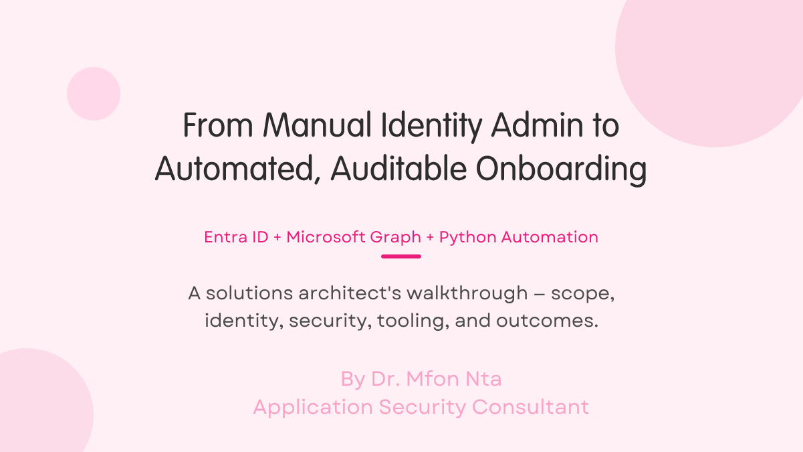
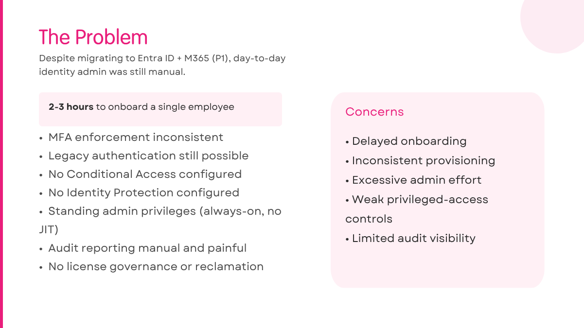
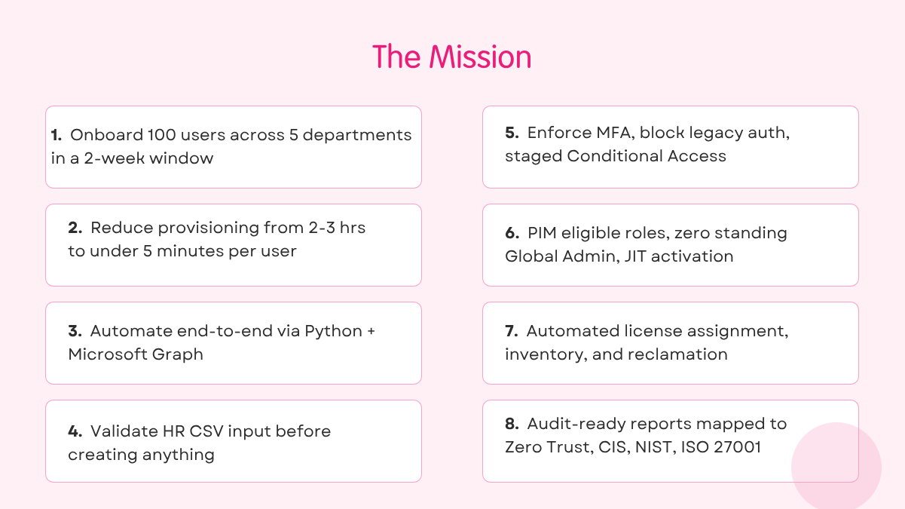
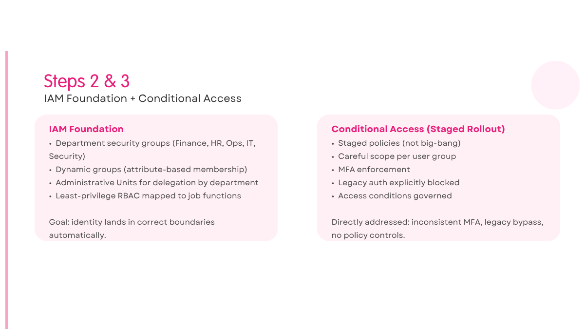
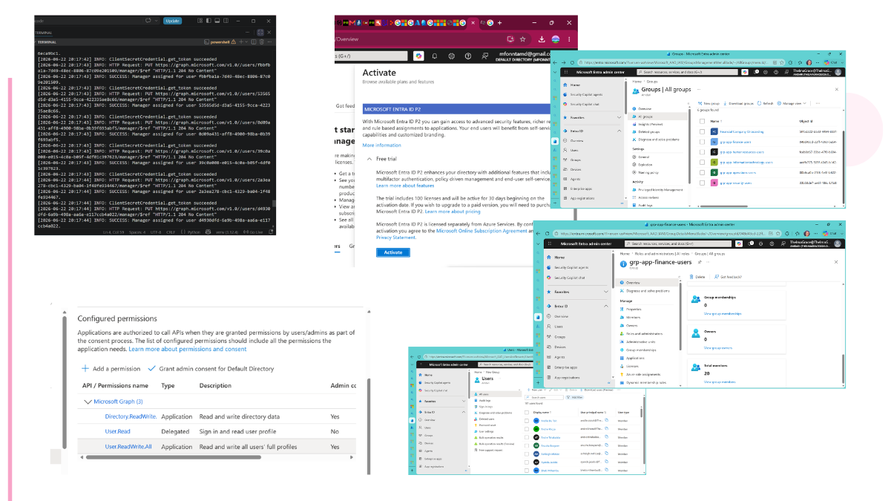
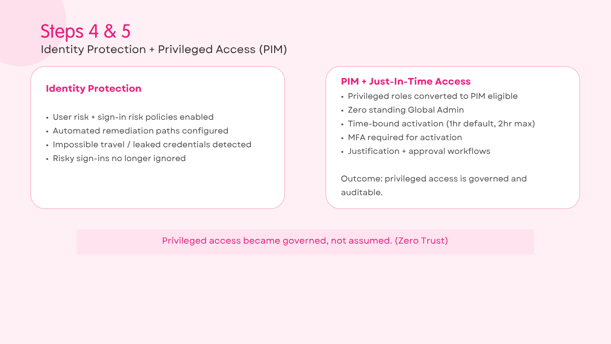
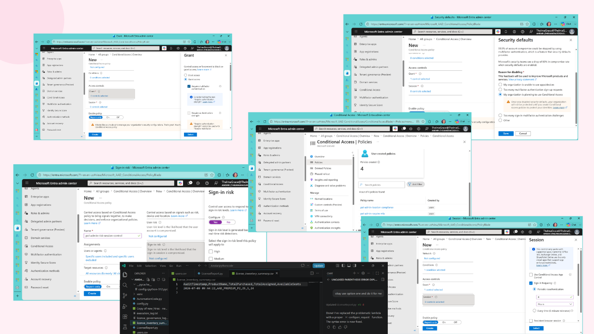
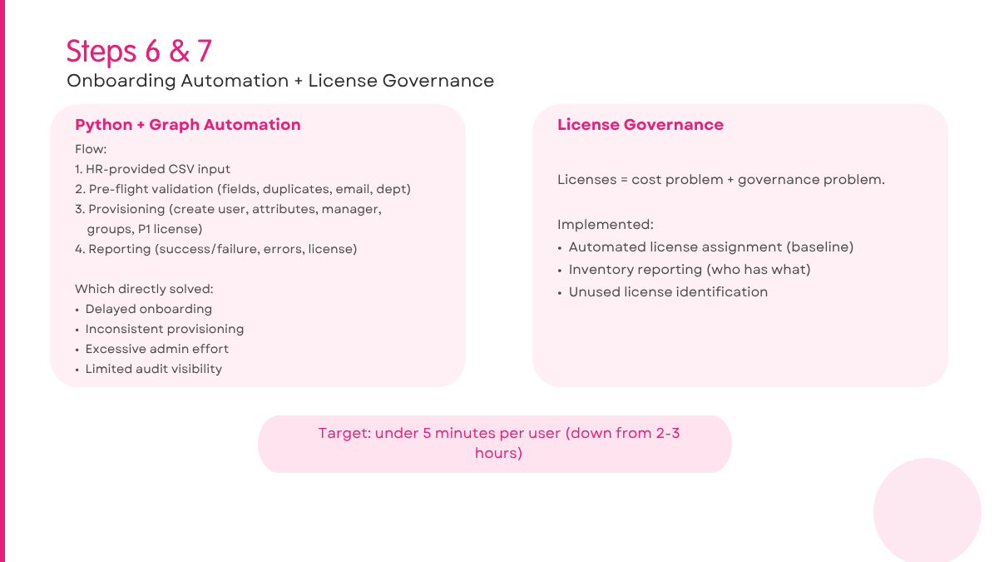
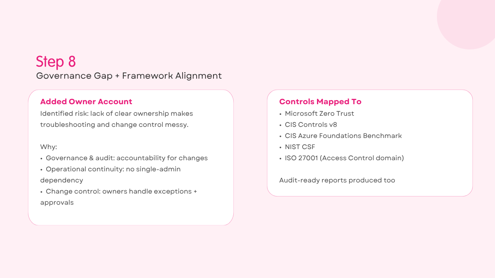
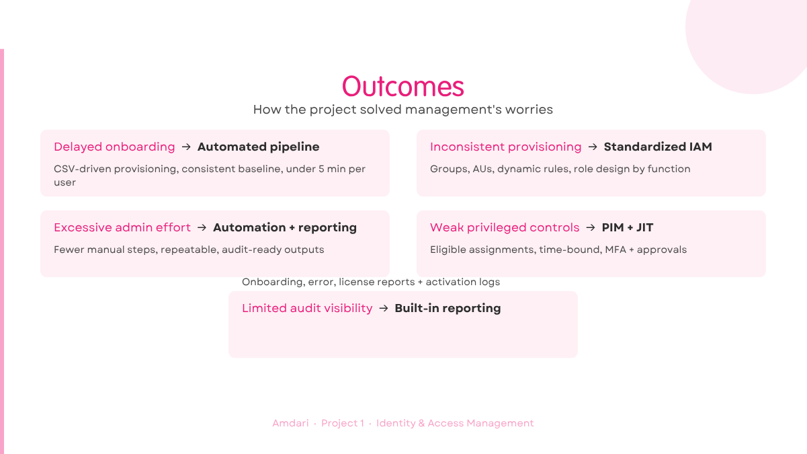

# Amdari Project 1 — From Manual Identity Admin to Automated, Auditable Onboarding (Entra ID + Graph)

## The story (why this project existed)

Amdari had already migrated to Microsoft cloud identity (Microsoft Entra ID + Microsoft 365 with P1 licensing), but the day-to-day work of identity administration still looked like "old IT":

> Despite the platform migration, day-to-day identity administration remains manual, performed individually by IT administrators.

That meant onboarding a single employee could take **2–3 hours**, and the quality of access depended on who handled the request and how busy they were that day.

At the same time, the security posture wasn't keeping up with the platform:
- MFA enforcement was inconsistent
- legacy authentication was still possible
- Conditional Access wasn't configured
- Identity Protection wasn't configured
- admin privileges were standing (always-on), with no Just-In-Time model
- audit reporting was hard and manual

Management's concerns were very direct:
> delayed onboarding, inconsistent provisioning, excessive administrative effort, weak privileged-access controls, and limited audit visibility.

So the assignment wasn't to "install Entra." It was to **close gaps** and produce an operational identity system that was:
- faster
- standardized
- secure by default
- auditable

---

## What I was asked to deliver (the mission)

This engagement had measurable objectives (not vibes):

1. **Onboard 100 users** across **five departments** within a two-week window.
2. Reduce provisioning time from **2–3 hours per user** to **under 5 minutes** per user.
3. Automate onboarding end-to-end using **Python + Microsoft Graph**:
   - account creation
   - attributes + manager
   - group assignment
   - license assignment (P1)
4. Validate HR CSV input **before** creating anything:
   - required fields
   - duplicates
   - email formats
   - department mapping
5. Enforce modern security controls:
   - MFA enforcement
   - block legacy authentication
   - staged Conditional Access rollout
6. Turn privileged access into a governed system:
   - **PIM eligible roles**
   - **Zero standing Global Admin**
   - **JIT activation** (time-bound, MFA, justification, approval)
7. Implement **license governance**:
   - automated assignment
   - inventory reporting
   - identify unused licenses
   - reclamation workflow
8. Produce **audit-ready reports** and map controls to frameworks:
   - Microsoft Zero Trust
   - CIS Controls v8
   - CIS Azure Foundations Benchmark
   - NIST CSF
   - ISO 27001 (Access Control domain)

---

## Step-by-step: what I did and how I did it

### Step 1 — I documented the current-state risks (so we fixed the right problems)
Before touching configuration, I wrote down the operational and security reality in plain language (and aligned it to what management was already worried about):

- Manual account creation: **2–3 hours** per employee
- Manual group + license assignment: error-prone
- No consistent baseline onboarding standard
- MFA inconsistent across user population
- Legacy auth allowed
- No Conditional Access policies
- Standing admin privilege (no JIT / no PIM)
- No Identity Protection policies (risk signals not acted on)
- Audit reporting = manual pain
- No license inventory/utilization/reclamation process

This became the baseline for measuring improvement.

---

### Step 2 — I built a clean IAM foundation (groups, Administrative Units, RBAC)
To prevent onboarding from becoming a "one-off script," I set up structure first:

- **Department security groups** (Finance, HR, Operations, IT, Security)
- **Dynamic groups** where needed (attribute-based membership)
- **Administrative Units** to delegate administration by department boundary
- A least-privilege **RBAC model** mapped to job functions (e.g., Helpdesk vs Security Reader vs User Admin)

The goal: once onboarding runs, the identity lands in the correct boundaries automatically.

---

### Step 3 — I implemented Conditional Access in a staged rollout (not "big bang")
Because Conditional Access can break access if rushed, I treated it like a deployment:
- staged policies
- careful scope
- enforcement of MFA
- explicit blocking of legacy auth paths
- aligned to "how and from where access is granted"

This directly addressed:
- inconsistent MFA enforcement
- legacy authentication protocols bypassing modern controls
- lack of policy controls around access conditions

---

### Step 4 — I configured Identity Protection (risk-based detection + remediation)
The project required more than "MFA everywhere." It required detection and response:

- enabled **user risk** and **sign-in risk** policies
- configured automated remediation paths (e.g., require secure actions when risk is high)
- ensured risky sign-ins (impossible travel / leaked credentials patterns) were not ignored

This directly addressed:
- "risky sign-ins undetected"
- "no automated remediation when compromise indicators appear"

---

### Step 5 — I removed standing privilege using PIM + Just-In-Time access
One of the most important security outcomes: **no always-on power accounts.**

So I:
- converted privileged roles to **PIM eligible assignments**
- implemented **Just-In-Time activation** with:
  - time-bound access (default 1 hour, max 2 hours)
  - MFA
  - justification
  - approval workflows (where required)

Outcome: privileged access became **governed and auditable**, not assumed.

---

### Step 6 — I built the onboarding automation (Python + Microsoft Graph)
This is the engine that solved the "2–3 hours per employee" pain.

The automation flow was designed like a production system:

1. **Input**: HR-provided CSV
2. **Pre-flight validation**:
   - required fields present
   - duplicates detected
   - email format checks
   - department mapping checks
3. **Provisioning** (only after validation passes):
   - create user
   - set attributes + manager
   - add to department groups / dynamic rules
   - assign Entra ID P1 license
4. **Reporting**:
   - onboarding report (success/failure)
   - error report (actionable)
   - license assignment report

This directly addressed:
- delayed onboarding
- inconsistent provisioning
- admin effort
- audit visibility

---

### Step 7 — I added license governance (inventory + reclaim)
Licenses are both a cost problem and a governance problem. I implemented a model for:

- automated license assignment (baseline)
- inventory reporting (who has what)
- unused license identification
- reclaim workflow (reduce waste, improve control)

---

### Step 8 — I closed a governance gap: added an Owner account (accountability + continuity)
During implementation I identified an operational risk: **lack of clear ownership** can make troubleshooting and change control messy.

So I took an explicit governance step:

> Owners can manage membership and settings; having none is a governance risk and makes troubleshooting harder. I added my Admin Account as an Owner.

Why that mattered:
- **Governance & audit**: accountability for changes
- **Operational continuity**: no single-admin dependency
- **Change control**: owners can handle exceptions and approvals

---

## Outcomes (how the project solved management's worries)

### 1) Delayed onboarding → **Automated onboarding pipeline**
- CSV-driven provisioning with validation
- consistent baseline for every user
- under-5-minute provisioning target

### 2) Inconsistent provisioning → **Standardized IAM model**
- groups, AUs, dynamic rules
- role design by function
- predictable access outcomes

### 3) Excessive admin effort → **Automation + reporting**
- fewer manual steps
- repeatable process
- audit-ready outputs

### 4) Weak privileged controls → **PIM + JIT**
- eligible assignments
- time-bound activation
- MFA + approvals + justification
- no standing Global Admin

### 5) Limited audit visibility → **Built-in reporting + governance**
- onboarding reports
- error reports
- license reports
- traceable privileged activation logs

---
